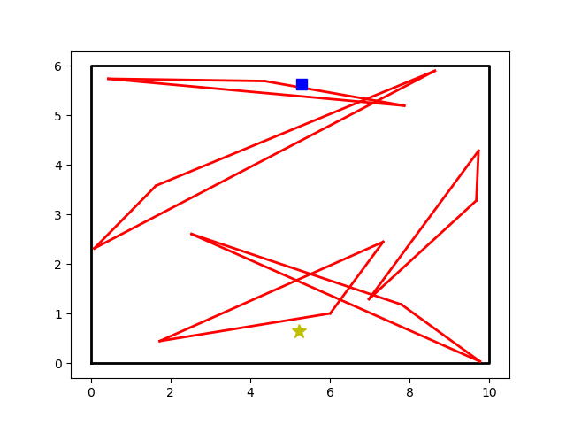
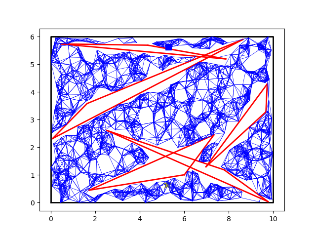
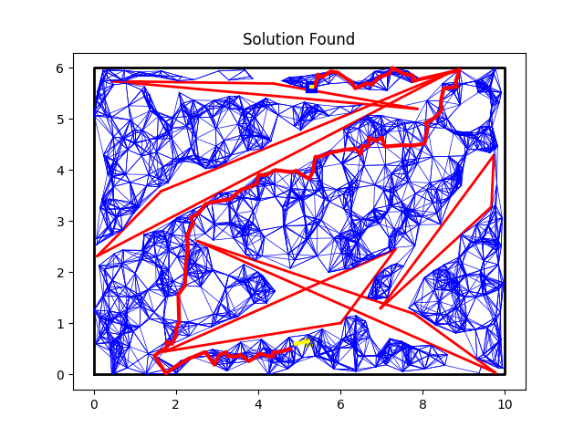
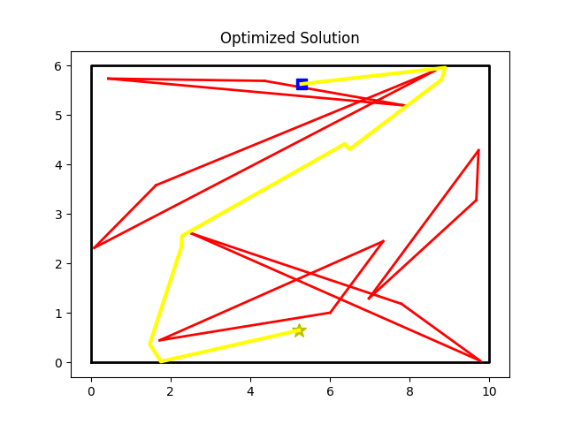

## Probabilistic Roadmap Path Planning and Path improvement
 
 These are exercises from [Path planning](https://www.osrobotics.org/osr/planning/path_planning.html) and [Post processing](https://www.osrobotics.org/osr/planning/post_processing.html). The code for PRM planner is written based on the pseudocode at [here](http://www.cs.columbia.edu/~allen/F15/NOTES/Probabilisticpath.pdf). 


## Dependencies
1. scikit-learn = 0.24.2
2. Shapely = 1.8.1

## Installation
1. gitclone this repo.

2. Conda environment file will be provided soon.

&nbsp;

## How to Run?
```python
1. python PRM.py

or

2. python PRM.py -s 1000 -n 10 -r 10 --seed 4 

    n_sample       - number of vertices to sample from map
    n_neighbors    - no of nearest vertices to connect
    max_radius     - max search space / maximum length of edges
    seed           - set seed value
    map_width      - map width
    map_height     - map height
    n_obstacle     - number of obstacle
    output_image_path - path to save result

```
  
&nbsp;

### Some images to illustrate the algorithm
* **Initial Map**
  
  5 obstacles have been generated on the map. The blue cube is the starting point whereas the star is the ending point.

&nbsp;
* **Generate edges with the points samples on the map**

    
    Random n points are sampled, collision-free edges are formed with the (n_neighbors) nearest numbers of vertices below max_radius.
&nbsp;
* **Shortest path from the connected edges**

    
    The starting point and goal are connected to the nearest vertex( yellow line), djikstra algorithm is used as a local planner to find the shortest path from starting point to the goal.


* **Post-process path to improve the path**

    
    Using brute force(greedy search) to connect the points from starting points(left) to the ending points (right) without collision
